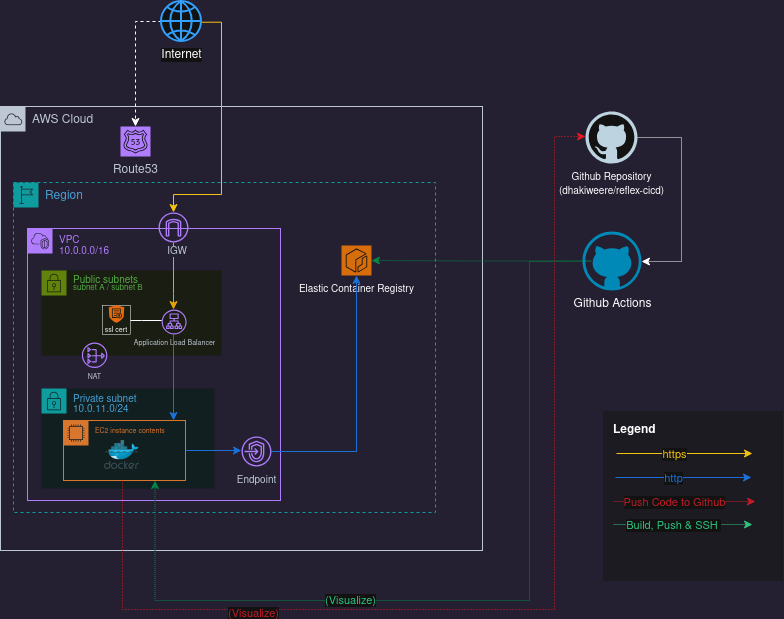

# Reflex CI/CD

> Full-Duplex Continuous Integration & Deployment Pipeline

Reflex CI/CD is an experimental full-duplex (bi-directional) CI/CD system built on AWS that blurs the traditional boundary between code and deployment. Unlike conventional pipelines that flow strictly from repository → deployment, Reflex enables a live web application to push code changes back to the repository, triggering an immediate rebuild and redeployment of itself.

At its core, Reflex demonstrates a self-updating web application where user-initiated code changes made directly through the application UI are treated as first-class commits in the CI/CD lifecycle.

## Core Idea

The hosted web application is both:
- **A deployment target** (receiving updates via GitHub Actions), and
- **A deployment source** (pushing code changes back to GitHub)

This creates a bi-directional CI/CD workflow, enabling real-time, user-driven application evolution.

## Architecture Overview

The system operates as follows:

1. The application is hosted on an EC2 instance, running as a Docker container
2. Route 53 resolves the application domain and routes traffic to an Application Load Balancer (ALB)
3. The ALB forwards requests to the EC2-hosted web application (stable version)
4. Users interact with a Monaco Editor–powered web UI, allowing them to modify the application code directly from the browser

### Deployment Flow

When changes are submitted:

1. The application commits and pushes the updated code to a GitHub repository
2. This triggers a GitHub Actions workflow
3. The workflow builds a new Docker image and pushes it to Amazon ECR
4. GitHub Actions then securely SSHs into the EC2 instance
5. The EC2 instance pulls the latest image and runs the updated container
6. New incoming requests are served by the freshly deployed version

This process happens automatically and near-instantly, after which users are redirected to the updated application.

## CI/CD Pipeline Characteristics

- **Full-duplex CI/CD**: Code → Deploy and Deploy → Code
- Containerized deployments using Docker
- Automated builds and image versioning via GitHub Actions
- Private container registry using Amazon ECR
- Remote container lifecycle management via SSH
- Stateless redeployments with predictable rollback behavior

## Infrastructure & Automation

- AWS resources are provisioned using Terraform (stable build)
- ECR Lifecycle Policies and Cron-based cleanups ensure resource hygiene
- Environment reset and synchronization logic keeps deployed state aligned with repository state

## Monitoring & Observability

Operational visibility is provided through a containerized monitoring stack:

- **Prometheus** for metrics collection
- **Node Exporter** for EC2 system metrics
- **Grafana** for visualization and dashboards

All monitoring services run alongside the CI/CD system using Docker Compose, providing real-time insights into system health and performance.

## Technologies Used

### Cloud & Infrastructure
- AWS EC2, ECR, Route 53, Application Load Balancer
- Terraform

### CI/CD & Containerization
- GitHub Actions
- Docker & Docker Compose

### Application & Tooling
- Node.js (Web Application)
- Monaco Editor
- Linux, Bash, YAML

### Monitoring
- Prometheus
- Grafana
- Node Exporter

## ⚠️ Important Notes
This is an **experimental project** designed for learning and demonstration purposes. The ability for a deployed application to modify its own source code introduces significant security and operational considerations that would need careful evaluation before any production use.

## Author
[Dhanika Weerasekara - dhanikaweerasekara@outlook.com]